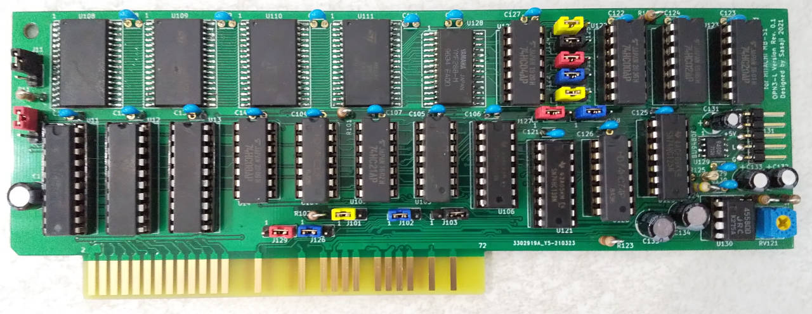

# Extended RAM & FM Synthesis Card for HITACHI MB-S1 (OPN3-L (YMF288) Version)

This is the extension card for HITACHI MB-S1 and Limelight. This is assembled two circuits
which are extended RAMs and FM Synthesis (YAMAHA YMF288(OPN3-L)). You can use two circuits, or just one of them.

## Used Tools

* KiCAD Version 5
